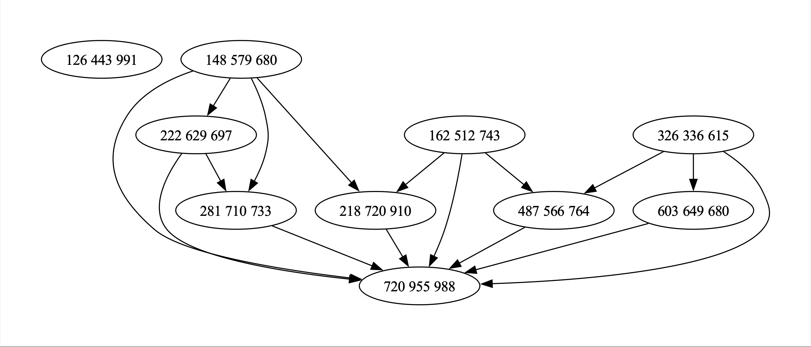

<!DOCTYPE html>
<html lang="en">
<head>
    <meta charset="UTF-8">
    <meta name="viewport" content="width=device-width, initial-scale=1.0">
    
    <title>Instructions to Run the Code</title>
</head>
<body>
    

        <h1>Instructions to Run the Code</h1>
        

            <h2>Table of Contents</h2>
            <ul>
                <li><a href="#intro">Introduction</a></li>
                <li><a href="#opening-terminal">Opening the Terminal</a></li>
                <li><a href="#compiling">Compiling the Code</a></li>
                <li><a href="#running-tests">Running Test Cases</a></li>
                <li><a href="#cleaning-up">Cleaning Up</a></li>
                <li><a href="#visualizing">Visualizing the Assignments</a></li>
                <li><a href="#output-image">Output Image</a></li>
                <li><a href="#conclusion">Conclusion</a></li>
            </ul>
        

        

            <h2>Introduction</h2>
            
You are not required to modify anything in the program files.   These instructions do NOT apply for Windows. They are intended for Unix-based systems like macOS and Linux.

        

        

            <h2>Opening the Terminal</h2>
            

                Open your terminal of preference, preferably the VSCode integrated terminal with:
                  
                <kbd>Ctrl</kbd> + <kbd>J</kbd>
            

        

        

            <h2>Compiling the Code</h2>
            

                Type make to compile the library and gain access to the fully compiled executable called main.
            

        

        

            <h2>Running Test Cases</h2>
            

                We have a directory called catalogues, containing different sizes of test cases. You can run them by typing ./main &lt;desired test case's relative path&gt;.
            

        

        

            <h2>Cleaning Up</h2>
            

                Don't forget to run make clean after you are done using the code. Feel free to alter the main file and make use of our different available methods as you wish.
            

        

        

            <h2>Visualizing the Assignments</h2>
            

                The make vis command is set to execute the assignment description graph. You can change it to any other test case in the Makefile (note that large test cases might not work well with graph visualization).
            

        

        

            <h2>Output Image</h2>
            
The default make vis command should output this image:

            
        

        

            <h2>Conclusion</h2>
            
If you have any questions or need further assistance, please contact [alex.gabriel@edu.pucrs.br] or [r.sandler@edu.pucrs.br].

        

    

</body>
</html>
